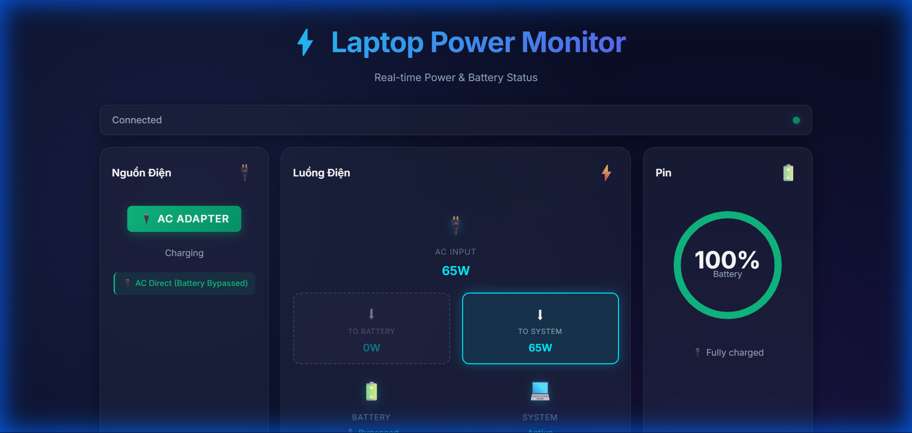

# 🔋 Laptop Power Monitor

A real-time web application to monitor laptop power consumption, battery status, and power source on Windows.


## 📸 Screenshot



*Real-time monitoring dashboard with modern dark mode UI showing power flow, battery status, and all power metrics*

## ✨ Features

- **Real-time Monitoring**: Updates every 2 seconds
- **Power Metrics**:
  - 📥 Power input (watts from AC adapter)
  - ⚙️ Power consumption (watts being used)
  - 🔋 Battery percentage with animated gauge
  - ⏱️ Estimated time remaining
  - 🔌 Power source (AC/Battery)
- **Modern UI**:
  - Dark mode with glassmorphism effects
  - Smooth animations and transitions
  - Responsive design
  - Gradient accents

## 📋 Requirements

- Windows OS
- Python 3.8 or higher
- Modern web browser (Chrome, Firefox, Edge)

## 🚀 Quick Start

### 1. Install Dependencies

```bash
pip install -r requirements.txt
```

### 2. Run the Server

```bash
python app.py
```

### 3. Open in Browser

Navigate to [http://localhost:5000](http://localhost:5000)

## 📦 Dependencies

- **Flask** - Web framework
- **flask-cors** - CORS support for API
- **psutil** - System and battery monitoring
- **pywin32** (optional) - Enhanced Windows power API access

## 🔧 How It Works

### Backend (Flask)
- Provides REST API endpoint at `/api/power-status`
- Uses `psutil` to read battery and power information
- Optionally uses Windows WMI for detailed power metrics
- Estimates power consumption based on battery discharge rate

### Frontend
- Modern HTML/CSS/JavaScript interface
- Fetches data from API every 2 seconds
- Animated SVG battery gauge
- Real-time metric updates with smooth transitions

## 📊 API Response Format

```json
{
  "hasBattery": true,
  "batteryPercent": 85,
  "powerPlugged": true,
  "powerSource": "AC Adapter",
  "powerInputWatts": 65,
  "powerConsumptionWatts": 52,
  "timeRemaining": "2h 30m",
  "isCharging": true,
  "status": "Charging"
}
```

## ⚠️ Notes

- Power consumption values are estimates based on battery discharge rate
- Exact wattage accuracy varies by laptop hardware and driver support
- Some laptops may not report detailed power metrics
- For best results, ensure latest chipset and battery drivers are installed

## 🎨 Customization

You can customize the update interval by editing `static/script.js`:

```javascript
const UPDATE_INTERVAL = 2000; // Change to desired milliseconds
```

## 📝 License

MIT License - Feel free to use and modify!

## 🤝 Contributing

Contributions welcome! Feel free to open issues or submit pull requests.

---

Made with ⚡ by Antigravity
